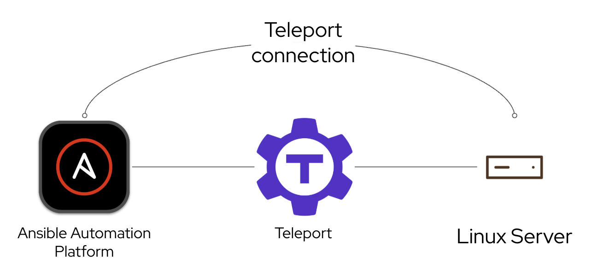
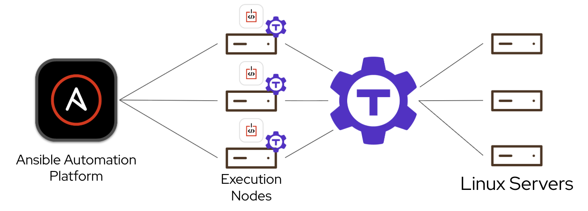
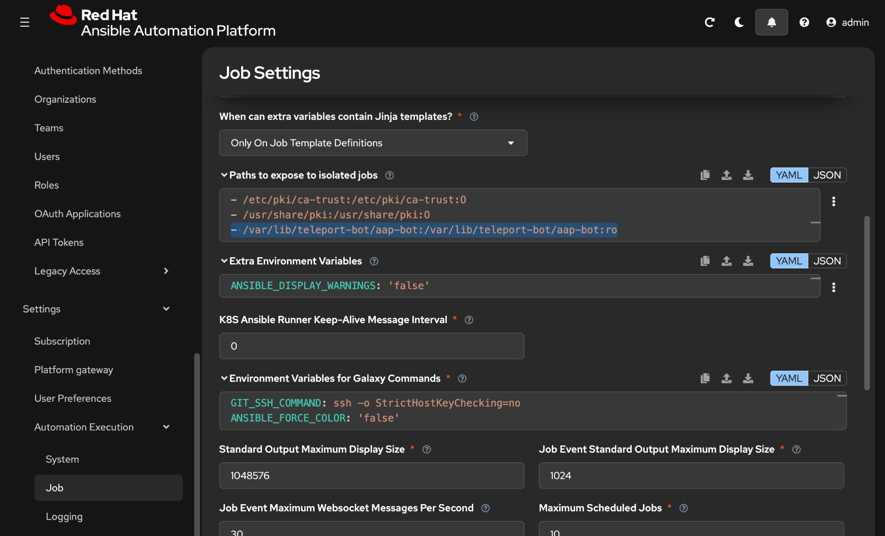
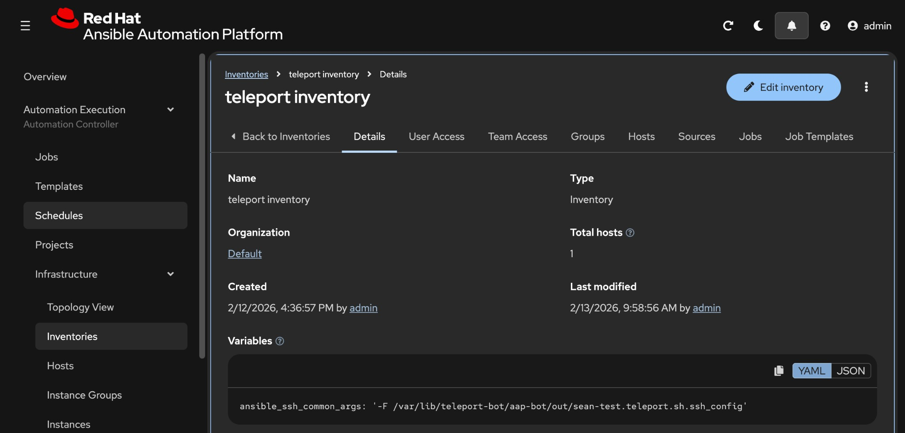
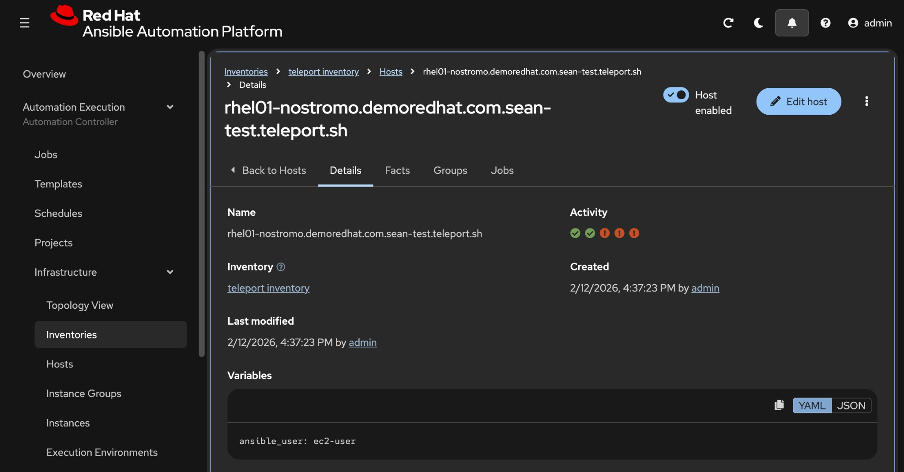

# Teleport tbot Service for Ansible Automation Platform

## What is Teleport?

[Teleport](https://goteleport.com/) is an identity-aware infrastructure access platform that replaces static SSH keys and passwords with short-lived certificates. Instead of distributing and managing SSH keys across your environment, Teleport issues certificates that automatically expire, providing secure access to Linux servers, Kubernetes clusters, databases, and more.

**Can Ansible use Teleport?** Yes. Ansible connects to hosts over SSH, and Teleport speaks standard SSH protocol. Once Teleport's SSH configuration is provided to Ansible, your existing playbooks work without any modification. No special Ansible modules or plugins are required. Ansible simply uses Teleport as its SSH transport layer.



---

## Which Guide Do I Follow?

There are three ways to integrate Teleport with Ansible, depending on your deployment model:

| # | Deployment Model | Guide |
|---|---|---|
| 1 | **Open Source Ansible (CLI)** | [Teleport + Ansible (CLI)](https://goteleport.com/docs/connect-your-client/third-party/ansible/) |
| 2 | **Ansible Automation Platform on OpenShift / Kubernetes** | [Teleport Machine ID + Ansible AWX](https://goteleport.com/docs/machine-workload-identity/access-guides/ansible-awx/) |
| 3 | **Ansible Automation Platform on RHEL (containerized installer)** | **This repository** |

### Category 1: Open Source Ansible (CLI)

If you are running Ansible from the command line (not AAP), follow Teleport's official guide. You log in with `tsh`, generate an SSH config with `tsh config`, and point Ansible at it. No systemd service or bind mounts needed.

### Category 2: AAP on OpenShift / Kubernetes

If your AAP runs on OpenShift or Kubernetes, Teleport provides an official guide that runs `tbot` as a sidecar container alongside your Execution Environment pods. This uses Kubernetes join tokens and does not require a persistent systemd service on the host.

### Category 3: AAP on RHEL (containerized installer) -- This Repo

If your AAP uses the **containerized installer on RHEL** (not OpenShift), your execution nodes are bare-metal or VM hosts running podman-based Execution Environments. There is no Kubernetes sidecar option. Instead, this repository installs `tbot` as a **systemd service** directly on the RHEL execution node, continuously renewing SSH certificates to a local directory that gets bind-mounted into EE containers at job runtime.

AAP on RHEL uses **automation mesh** to distribute work across multiple execution nodes. Automation mesh is a peer-to-peer overlay network that connects the AAP controller to remote execution nodes over encrypted channels, allowing jobs to run closer to the infrastructure they manage. Each execution node is a standalone RHEL host that runs Execution Environments as podman containers.



In this architecture, each execution node runs its own `tbot` systemd service (shown by the Teleport logo on each host). tbot continuously renews SSH certificates on the local filesystem. When AAP dispatches a job to an execution node, the EE container gets the certificates via a read-only bind mount, and uses them to SSH through the Teleport proxy to the target Linux servers. This playbook automates the tbot setup across all your execution nodes.

The bind mount is configured in AAP under **Settings → Automation Execution → Job → Paths to expose to isolated jobs**:



---

## Prerequisites

### 1. Teleport Administrator Must Complete (One-Time Setup)

Before running this playbook, a Teleport administrator must:

**Step 1: Create an SSH access role** (e.g., `aap-ssh`) in Teleport with:
```yaml
kind: role
version: v7
metadata:
  name: aap-ssh
spec:
  allow:
    logins: ['ec2-user', 'ansible', 'root']
    node_labels:
      '*': '*'  # Or restrict to specific labels
```

**Step 2: Configure bot impersonation** - After the playbook creates the bot (e.g., `bot-aap-bot`), update that bot role to allow impersonation:
```yaml
kind: role
version: v7
metadata:
  name: bot-aap-bot  # Auto-created by playbook
spec:
  allow:
    impersonate:
      roles:
        - aap-ssh
```

**Why this matters:**
- **Bot role** (`bot-aap-bot`): Bot's authentication identity (auto-created by playbook)
- **Access role** (`aap-ssh`): SSH permissions the bot impersonates (must be pre-created)
- The bot authenticates as itself, then requests to impersonate the access role to get SSH certificates
- This separation is a Teleport security model - the playbook cannot configure impersonation permissions

### 2. Execution Node Requirements

- RHEL9 (or compatible)
- Outbound network access to Teleport proxy
- SELinux enforcing (supported)
- Root/sudo access for playbook execution

### 3. Execution Environment Requirements

Your EE must have:
- `tsh` binary installed (e.g., `/usr/local/bin/tsh`)
- Mount point configured in AAP for the certificate directory

- Working EE image: `quay.io/acme_corp/teleport-ssh-ee`
- EE build source: https://github.com/ansible-tmm/ee-builds/tree/main/teleport-ssh-ee

## Usage

```bash
ansible-playbook install_tbot.yml \
  -i inventory.ini \
  -e teleport_proxy_addr=sean-test.teleport.sh:443 \
  -e teleport_bot_name=aap-bot \
  -e teleport_access_role=aap-ssh \
  -e teleport_admin_user=your-username \
  -e teleport_admin_password=your-password \
  -e teleport_mfa_token=123456
```

**Note:** The playbook will create the bot in Teleport automatically. After the first run, you must configure the bot role impersonation (see Prerequisites above).

## Required Extra Variables

- `teleport_admin_user`: Your Teleport admin username
- `teleport_admin_password`: Your Teleport admin password (handled securely with no_log)
- `teleport_mfa_token`: Your 6-digit MFA/TOTP code from authenticator app (handled securely with no_log)

## Optional Variables (with defaults)

- `teleport_proxy_addr`: Teleport proxy address (default: `teleport.example.com:443`)
- `teleport_bot_name`: Bot name for directory structure (default: `aap-bot`)
- `teleport_access_role`: Role that bot impersonates for SSH access (default: `aap-ssh`)
- `teleport_ca_pin`: CA pin for additional security (optional)
- `teleport_version`: Version to install (default: `17.1.4`)
- `teleport_arch`: Architecture (default: `amd64`)

## What It Does

1. **Installs Teleport binaries** (tbot, tsh, tctl) from CDN tarball
2. **Creates system user/group** (`tbot:tbot`)
3. **Sets up directory structure**:
   - `/var/lib/teleport-bot/` (base)
   - `/var/lib/teleport-bot/{bot_name}/data` (tbot state)
   - `/var/lib/teleport-bot/{bot_name}/out` (SSH certificates)
4. **Performs admin login** with username/password/MFA
5. **Creates bot in Teleport** and generates join token automatically
6. **Generates tbot.yaml** configured to:
   - Authenticate as `bot-{bot_name}`
   - Request impersonation of the access role (`aap-ssh`)
   - Write SSH identity to output directory
7. **Creates systemd service** that runs continuously
8. **Sets up automated EE access**: persistent SELinux fcontext + systemd path watcher
9. **Verifies** service is running and certificates are generated
10. **Cleans up** admin session for security

## Testing & Verification

### On the Execution Node

After running `install_tbot.yml`, verify directly on the RHEL host:

```bash
# Check tbot service status
sudo systemctl status tbot

# View logs
sudo journalctl -u tbot -n 50 --no-pager

# Verify certificate exists and is fresh
sudo ls -la /var/lib/teleport-bot/aap-bot/out/identity

# Test SSH manually
sudo /usr/local/bin/tsh \
  --identity=/var/lib/teleport-bot/aap-bot/out/identity \
  --proxy=sean-test.teleport.sh:443 \
  ssh ec2-user@rhel01-nostromo.demoredhat.com
```

### From AAP

#### Step 1: Create a Teleport Inventory in AAP

Create a **separate inventory** in AAP for Teleport-protected hosts. This inventory is different from the one used by `install_tbot.yml` (which targets execution nodes via normal SSH).

On the **inventory level**, set the `ansible_ssh_common_args` variable so all hosts in this inventory route SSH through the Teleport-generated `ssh_config`:

```yaml
ansible_ssh_common_args: '-F /var/lib/teleport-bot/aap-bot/out/sean-test.teleport.sh.ssh_config'
```



> **Why inventory and not ansible.cfg?** This project contains both `install_tbot.yml` (normal SSH to execution nodes) and test playbooks (Teleport SSH to protected hosts). Putting `ssh_args` in `ansible.cfg` would break the install playbook. By using an inventory variable, only Teleport hosts get the Teleport SSH config. See `inventory.ini` for a file-based example.

#### Step 2: Add Hosts Using the Teleport Hostname Format

Teleport hosts use a special naming convention. The host name in your AAP inventory is **not** the regular DNS name -- it is the real hostname **plus** the Teleport cluster domain appended to it:

```
{real-hostname}.{teleport-cluster-domain}
```

For example, if:
- Real DNS name: `rhel01-nostromo.demoredhat.com`
- Teleport cluster: `sean-test.teleport.sh`

Then the AAP host name must be:
```
rhel01-nostromo.demoredhat.com.sean-test.teleport.sh
```

Set `ansible_user` on the host to the SSH login user (e.g., `ec2-user`):



#### Step 3: Create Job Templates

Create Job Templates in AAP with:
- **Playbook**: `test_connectivity.yml` (simple ping test) or `test_teleport_access.yml` (detailed EE + SSH verification)
- **Inventory**: Your Teleport inventory (created above)
- **Execution Environment**: `quay.io/acme_corp/teleport-ssh-ee`

#### Step 4: Run and Verify

Launch the job. `test_connectivity.yml` will:
1. Show the active Ansible config and `ssh_args` being used
2. Check that the Teleport `ssh_config` file is accessible from inside the EE
3. Run `ansible.builtin.ping` against each host through Teleport

For a more thorough test, `test_teleport_access.yml` checks identity file access and SSH connectivity separately:

```
✅ TEST 1: Identity file is accessible
✅ TEST 2: SSH connectivity via Teleport works
🎉 ALL TESTS PASSED!
```

A successful run means:
- The EE can read the bind-mounted tbot certificates
- SSH is routing through the Teleport proxy via the generated `ssh_config`
- The Teleport host is reachable and accepting the bot's SSH certificate

## How It Works

### Teleport RBAC Model

When tbot runs:

1. **Bot authentication**: tbot authenticates to Teleport as `bot-{bot_name}` using the join token (first time) or stored identity (subsequent renewals)
2. **Role impersonation request**: tbot requests to impersonate `{access_role}` (e.g., `aap-ssh`)
3. **Permission check**: Teleport verifies the bot role is allowed to impersonate the access role (configured in Teleport RBAC)
4. **Certificate generation**: Teleport issues short-lived SSH certificates with `{access_role}` permissions
5. **File output**: Certificates are written to `/var/lib/teleport-bot/{bot_name}/out/identity`
6. **Continuous renewal**: tbot automatically refreshes certificates every ~20 minutes before expiration

**Key points:**
- Impersonation permissions are configured in **Teleport RBAC**, not in tbot.yaml or this playbook
- The join token is single-use for initial enrollment only
- After enrollment, tbot uses its stored identity to renew certificates automatically
- No additional tokens or credentials are needed after initial setup

### Automated Permission Watcher

tbot writes output files (identity, ssh_config, etc.) with `0600` permissions on every renewal cycle (~20 min). Since AAP Execution Environments access these files via bind mount, they need to be world-readable.

The playbook creates a **systemd path watcher** (`tbot-perms.path` + `tbot-perms.service`) that:
1. Monitors the output directory for changes
2. Automatically runs `chmod -R o+rX` to make files readable
3. Runs `restorecon` to ensure SELinux `container_file_t` labels are applied

This means permissions are fixed automatically within seconds of every tbot renewal -- no cron jobs or manual intervention needed.

```bash
# Check watcher status
sudo systemctl status tbot-perms.path
sudo systemctl status tbot-perms.service
```

## Troubleshooting

### Common Issues

#### 1. Error: "user 'bot-aap-bot' has requested role impersonation for ['aap-ssh']"

**Symptom:**
- tbot service is running but logs show repeated failures
- Identity file timestamp is old and not being updated
- SSH attempts fail with "cert has expired"

**Cause:** The bot role doesn't have permission to impersonate the access role in Teleport.

**Fix:**
1. Log into Teleport as an administrator
2. Navigate to: **Access Management → Roles → bot-aap-bot**
3. Edit the role and add:
   ```yaml
   spec:
     allow:
       impersonate:
         roles:
           - aap-ssh
   ```
4. Save the role configuration
5. Restart tbot on the execution node:
   ```bash
   sudo systemctl restart tbot
   sudo journalctl -u tbot -f
   ```

Look for `Task succeeded. Waiting interval task:output-renewal` to confirm it's working.

#### 2. AAP Job: "Identity file not found" or "Permission denied"

**Cause:** Mount not configured in AAP, or first run before permission watcher triggers.

**Fix:**

The playbook now **automatically** handles permissions and SELinux:
- Directories are created with `0755` (world-traversable)
- SELinux `container_file_t` fcontext is set persistently via `semanage`
- A `tbot-perms.path` systemd watcher auto-fixes file permissions every time tbot renews certificates (~20 min)

**In AAP** (one-time setup):
1. Go to **Settings → Automation Execution → Job**
2. Add to **Paths to expose to isolated jobs**:
   ```
   /var/lib/teleport-bot/aap-bot:/var/lib/teleport-bot/aap-bot:ro
   ```

**If you still get permission errors** after the playbook has run, verify the watcher is active:
```bash
sudo systemctl status tbot-perms.path
sudo systemctl status tbot-perms.service  # Shows last trigger time

# Manual fix if needed
sudo chmod -R o+rX /var/lib/teleport-bot/aap-bot/out/
sudo restorecon -R /var/lib/teleport-bot/aap-bot/out/
```

#### 3. Certificates Not Renewing

Check tbot service and logs:
```bash
sudo systemctl status tbot
sudo journalctl -u tbot -n 100 --no-pager | grep -i error
```

Common causes:
- Network connectivity to Teleport proxy
- RBAC permissions changed in Teleport
- tbot service crashed (check systemd restart counter)